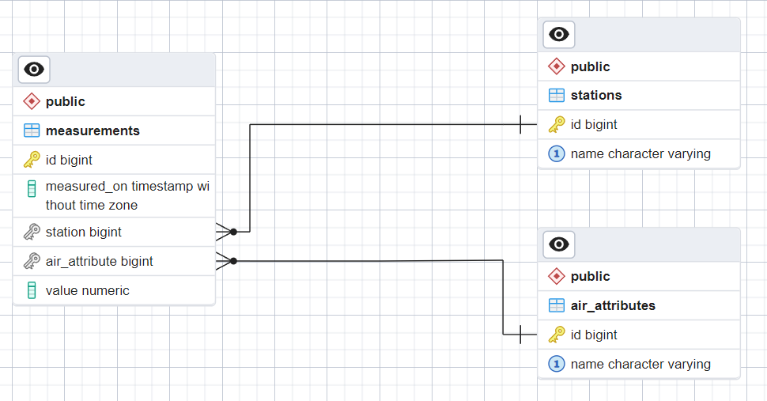
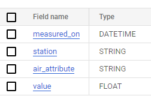

# Buenos Aires Data - Calidad de Aire

## Requisitos

Paquetes: `python3 y python3-pip`

Servicios: `Docker`
 
## Diseño de arquitectura y workflow

El sistema consta de tres componentes principales:
1. Una base de datos relacional (postgres) que emula un OLTP típico, con una estructura normalizada.
2. Un proceso ETL que se conecta al OLTP para la extracción, realiza una transformación sobre los datos y los carga a un Data Warehouse.
3. Un Data Warehouse (Google BigQuery) que almacena los datos de una forma no normalizadas, para luego ser expuestos a través de un Dashboard interactivo (Google Looker)

La base de datos relacional tiene la siguiente estructura:



A su vez, el Data Warehouse tiene solo una tabla con la siguiente estructura



El workflow del sistema es el siguiente:

1. Se crea un contenedor de Docker donde corre la base de datos postgres
2. Se ejecuta un script de python en su propio ambiente virtual que:
    1. Crea la estructura de la base de datos OLTP.
    2. Limpia, preprocesa e inserta los datos provenientes del CSV público sobre la calidad de aire de Buenos Aires Data.
3. Una vez que la base de datos está cargada se ejecuta un proceso ETL definido usando Luigi que:
    1. Extrae los datos de la base de datos postgres y los almacena temporalmente como varios CSVs dentro de un archivo ZIP
    2. Descomprime el archivo ZIP, transforma los datos desnormalizándolos y genera un CSV final.
    3. Toma el CSV final y lo carga en una tabla de un Dataset de Google Bigquery (el proyecto existe previamente), utilizando para ellos credenciales de servicio específicamente creadas con ese fin.
4. Una vez que los datos ya están cargados en la tabla de BigQuery se aplican varias consultas SQL que alimentan un Dashboard ya configurado en Google Looker.


## Instrucciones para ejecutar el workflow:

### 1. OLTP
Entrar al directorio oltp y ejecutar run_oltp.sh.
```bash
cd oltp
./run_oltp.py
```
AL finalizar, la base de datos postgres va a contener todos los datos limpios y preprocesados del CSV fuente, de acuerdo a su estructura normalizada.

### 2. ETL
Entrar al directorio etl y ejecutar run_etl.sh.
```bash
cd .. # solo si todavía se encuentra en el directorio oltp
cd etl
./run_etl.py
```
Al finalizar, los datos procesados ya van a estar subidos a la tabla de BigQuery.

**IMPORTANTE: para que la carga sea exitosa se necesita contar con el archivo de clave de cuenta de servicio en `etl/buenos-aires-data-c8b43156979d.json`. Si no se posee la clave el upload fallará. De todos modos, se puede examinar el CSV final a subir en `etl/tmp/processed_air_quality.csv`**

### 3. OLAP
Acceder al Dashboard con el siguiente link: https://lookerstudio.google.com/reporting/b0cbe92b-2a80-4d66-a047-173519a98c38

Como el Dashboard ya se encuentra configurado solo quedan listadas en `olap/dashboard_queries.sql` las consultas SQL que lo alimentan (ya que no son visibles desde el Dashboard).